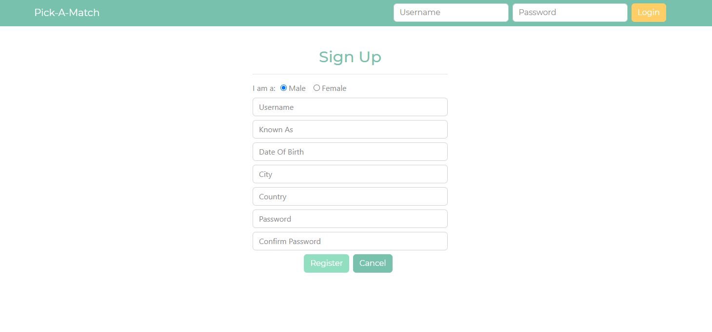
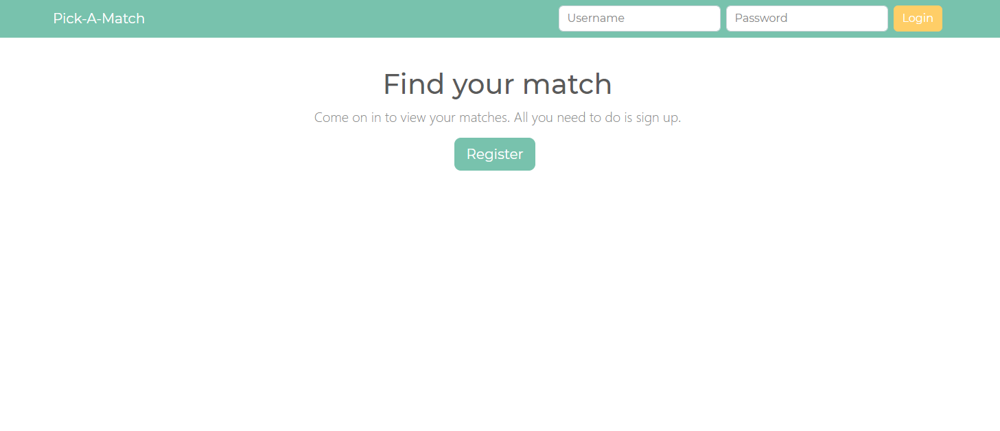
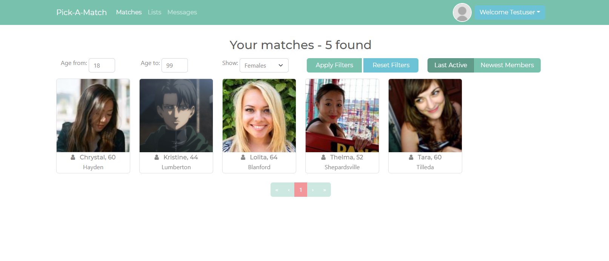
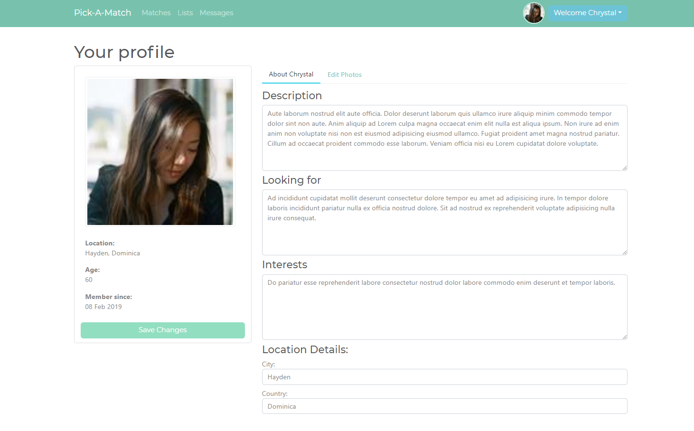
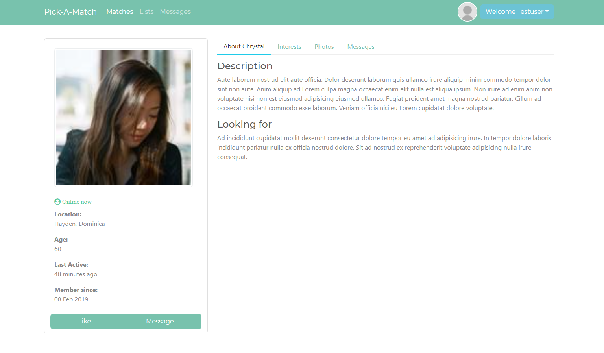
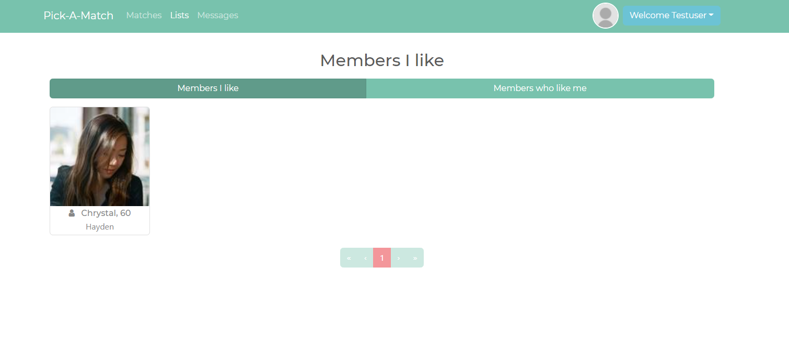
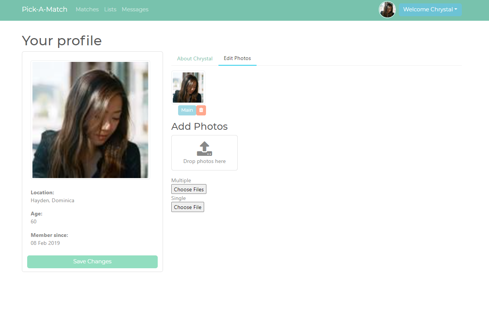
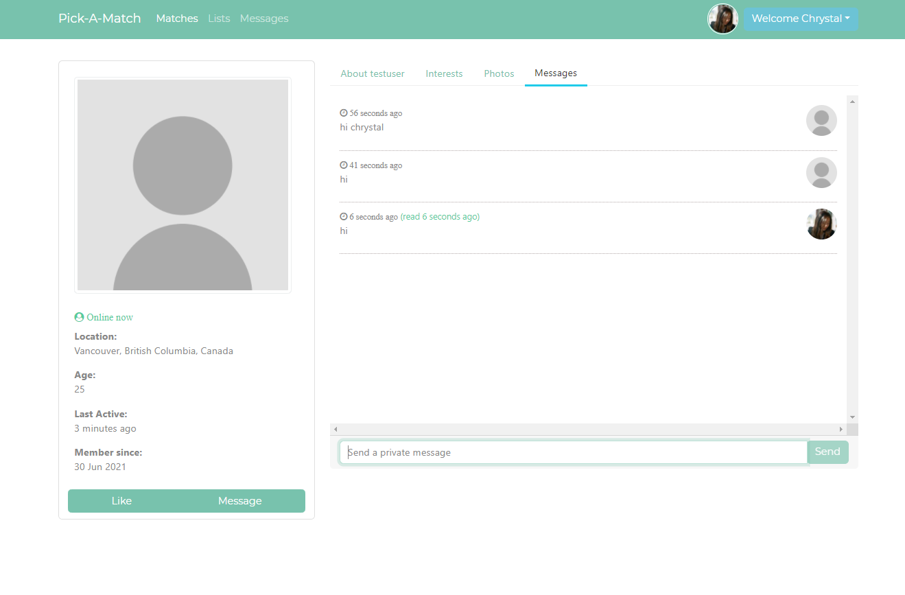
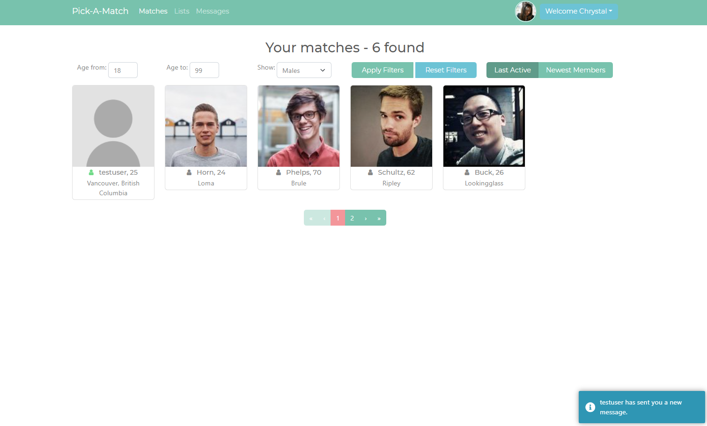

# Pick-A-Match
Web application where users can find different matches from registered users, and start a chat with live messaging and presence tracking.

Visit https://pick-a-match.herokuapp.com/ to create an account and use the app. The app is injected with some default users.

# Functionality of the app
- Register new users
- Authentication
- Add user profile details i.e., interests, hobbies, etc.
- Pagination
- Temporary caching system to limit unnecessary API calls
- Support profile images
- Users can like other users
- Users can view other registered user's details, but not edit
- Users can start a live chat with one another

# Quick peek at demo of application

Register

Home

Matches

Profile

Description

Like Members

Adding Photos

Live Messaging

Live Notifications

